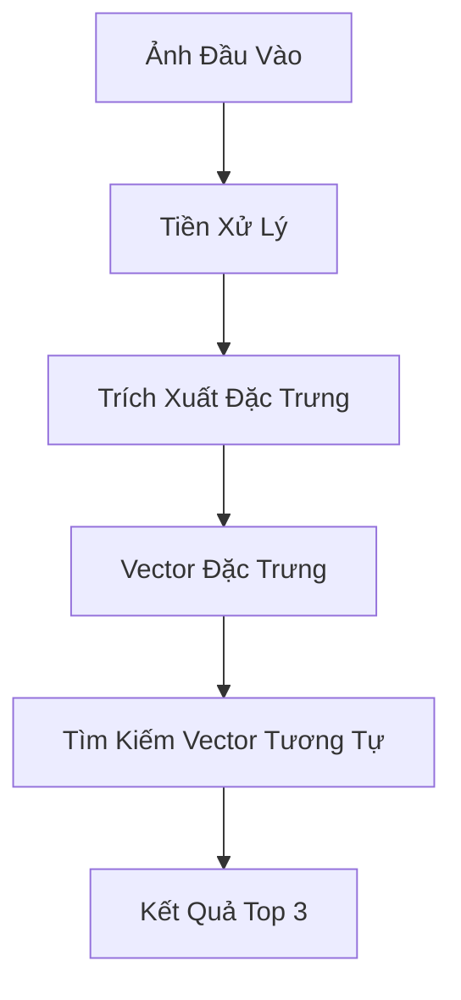

# Báo Cáo Hệ Thống Tìm Kiếm Ảnh Hoa Tương Tự

## 2. Xây Dựng Bộ Thuộc Tính Nhận Diện Ảnh Hoa

### 2.1 Lựa Chọn Mô Hình Trích Xuất Đặc Trưng

Hệ thống sử dụng mô hình ResNet50 để trích xuất đặc trưng từ ảnh hoa. Lý do lựa chọn:

1. **Kiến trúc ResNet50**:

   - Sử dụng kiến trúc Residual Network với 50 lớp
   - Có khả năng học các đặc trưng phức tạp nhờ skip connections
   - Đã được pre-train trên tập dữ liệu ImageNet lớn

2. **Đặc trưng được trích xuất**:

   - Vector 2048 chiều từ lớp fully connected cuối cùng
   - Chứa thông tin về:
     - Màu sắc và kết cấu của cánh hoa
     - Hình dạng và cấu trúc của bông hoa
     - Các đặc điểm chi tiết như viền, gân lá, v.v.

3. **Ưu điểm của phương pháp**:
   - Không cần huấn luyện lại mô hình
   - Có khả năng tổng quát hóa tốt
   - Trích xuất được các đặc trưng có ý nghĩa ngữ nghĩa

### 2.2 Xử Lý Ảnh Đầu Vào

1. **Tiền xử lý ảnh**:

   - Resize ảnh về kích thước 224x224 pixels
   - Chuẩn hóa giá trị pixel về khoảng [-1, 1]
   - Áp dụng các phép biến đổi để tăng tính ổn định

2. **Chuẩn hóa đặc trưng**:
   - L2 normalization để đảm bảo tính nhất quán
   - Giảm ảnh hưởng của các đặc trưng có giá trị lớn

## 3. Xây Dựng Hệ Thống Tìm Kiếm Ảnh

### 3.1 Sơ Đồ Khối Hệ Thống

### 3.2 Quy Trình Thực Hiện

1. **Giai đoạn chuẩn bị dữ liệu**:

   - Thu thập ảnh hoa từ nhiều loại khác nhau
   - Tổ chức dữ liệu theo cấu trúc thư mục
   - Tiền xử lý và trích xuất đặc trưng cho toàn bộ dataset

2. **Giai đoạn tìm kiếm**:
   - Nhận ảnh đầu vào từ người dùng
   - Trích xuất đặc trưng của ảnh đầu vào
   - So sánh với các vector trong database
   - Trả về 3 ảnh có độ tương đồng cao nhất

### 3.3 Lưu Trữ và Tìm Kiếm Vector

1. **Lưu trữ vector**:

   - Sử dụng ChromaDB làm vector database
   - Lưu trữ vector đặc trưng và metadata
   - Tổ chức theo collection để dễ quản lý

2. **Tìm kiếm tương tự**:
   - Sử dụng cosine similarity để tính độ tương đồng
   - Lấy top 3 kết quả có độ tương đồng cao nhất
   - Trả về kết quả kèm theo độ tương đồng

## 4. Demo và Đánh Giá

### 4.1 Giao Diện Người Dùng

Hệ thống cung cấp hai giao diện:

1. **Streamlit Frontend**:

   - Giao diện trực quan, dễ sử dụng
   - Hiển thị ảnh upload và kết quả tìm kiếm
   - Hiển thị độ tương đồng và thông tin file

2. **FastAPI Backend**:
   - Cung cấp API endpoint cho việc tìm kiếm
   - Xử lý upload file và trả về kết quả
   - Hỗ trợ CORS cho việc tích hợp

### 4.2 Đánh Giá Kết Quả

1. **Độ chính xác**:

   - Hệ thống trả về ảnh có độ tương đồng cao
   - Kết quả phù hợp với đặc điểm của ảnh đầu vào
   - Có khả năng nhận diện các đặc trưng quan trọng của hoa

2. **Hiệu suất**:

   - Thời gian xử lý nhanh
   - Tối ưu hóa việc lưu trữ và tìm kiếm vector
   - Khả năng mở rộng tốt

3. **Khả năng mở rộng**:
   - Dễ dàng thêm ảnh mới vào database
   - Có thể tích hợp với các hệ thống khác
   - Khả năng cải thiện và nâng cấp
